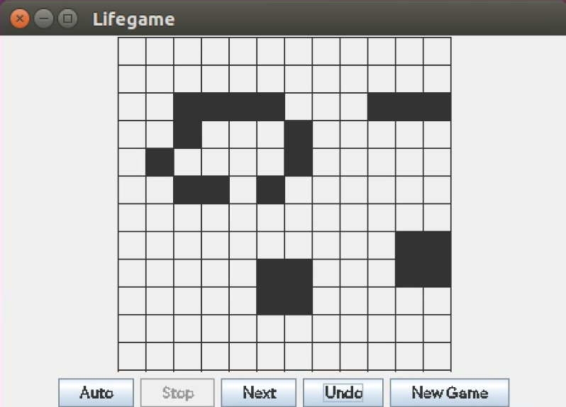
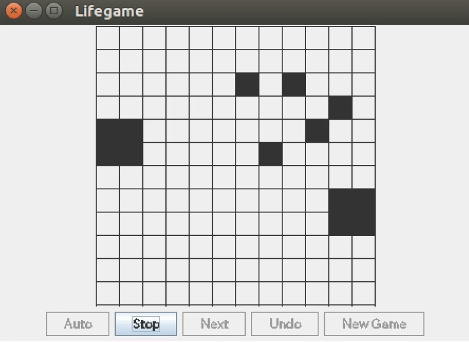

# Conway's Game of Life

Java implementation of the well known Conway's Game of Life that supports alive cell selection via cursor selection as well as manual and automatic reproduction of the game. 

<p float="center">
  
   
</p>

## Usage

Execute the following command to clone the source code and open the folder called Game-of-Life.

```
git clone git@github.com:crafaelgil/Game-of-Life.git
```
Then, inside the src directory, execute the following two commands:

```zsh
javac -cp . lifegame/*.java

java -cp . lifegame/Main
```

This will compile the code and run the main window. To create a new game simple click on the New Game button.

